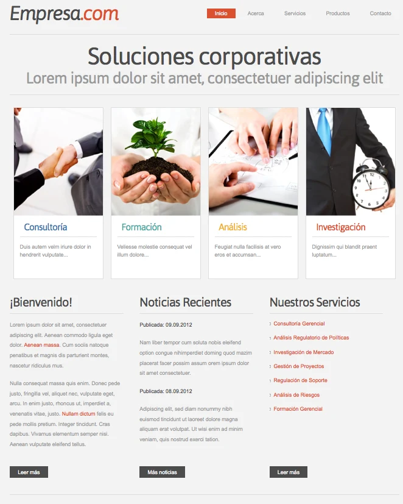

# Front-end exercise (2020/04/09)

## Description result of the exercise

In this exercise, html5 and css3 are used directly without javascript intervention.

JavaScript code is only used to apply the menu effect, and also to color card titles.

The page was intended to be presented mobile-first ([Link to Exercise](https://jhnemogap.github.io/front-end_exercise_200409/)). The similarity of the replica made can be seen from a width greater than 1024px and better from 1200px onwards.

**NOTE**: It was decided to make some visual improvements to the mockup to improve the presentation on different device sizes, specifically increasing the font size accordingly.

### Documentation

For this stage of the project, the html and css documentation was done in the same files with internal comments.

The javascript files received internal comments using the base tag naming used by projects like `documentjs` or `JSDoc`; but without installing any dependency at the moment.

### Proposed file structure

- **`index.html`**: all html web page in and entry point
- **`css`**: all files type `.css`
  - **`mediaQueries`**: this folder exclusively contains media queries
- **`image`**: images to serve. `.Webp` images were used to test their functionality
- **`js`**: all `.js` type documents

## Overview

This [image resembles a basic website](./resources/webImageHome.png). You will need basic understanding of HTML and CSS in order to achieve this.

### Goals

1. Replicate the website

### Specifications

The replica must be as exact as possible, with the correct color and images.
You’re only allowed to use HTML,CSS and JS, you cannot use any Framework or libraries.

### Milestones

Milestones are specifications that will be added in the near future.

#### Start script

The project must have a system that allows him to build it and run it.

#### Testing

You must implement unit and integration testing to your code.
